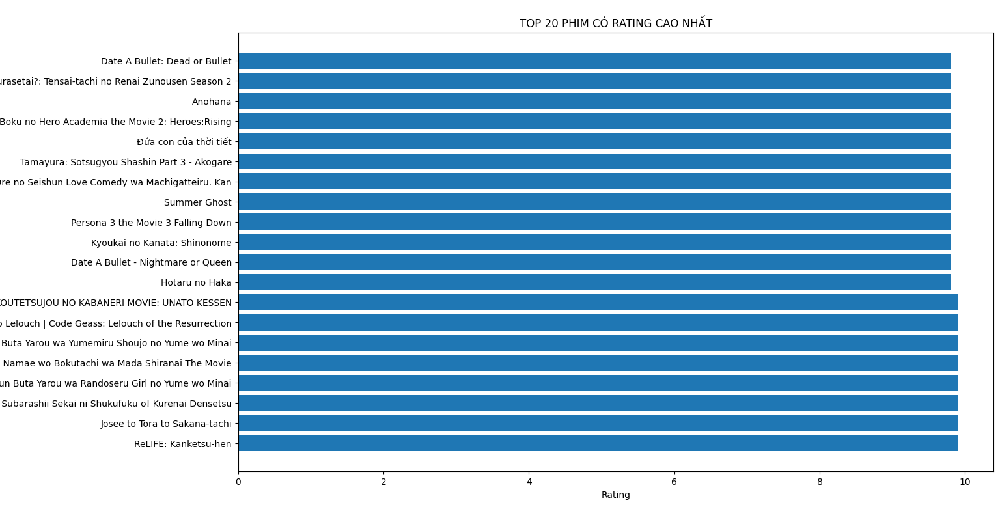
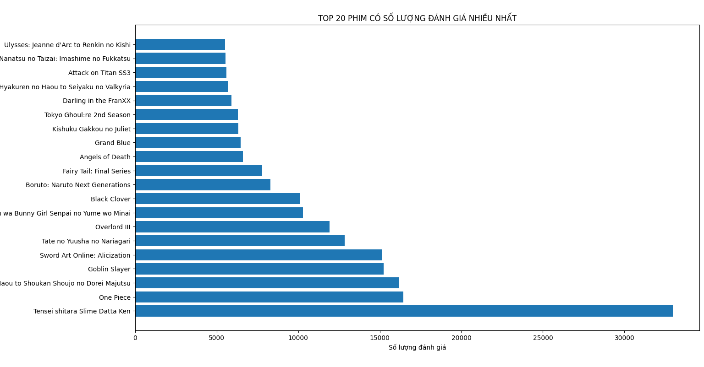
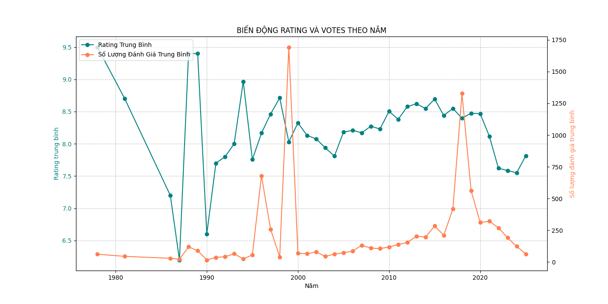
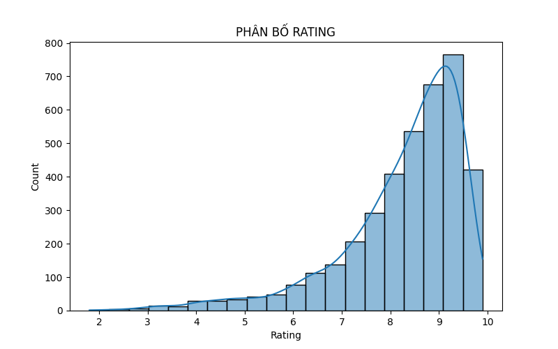
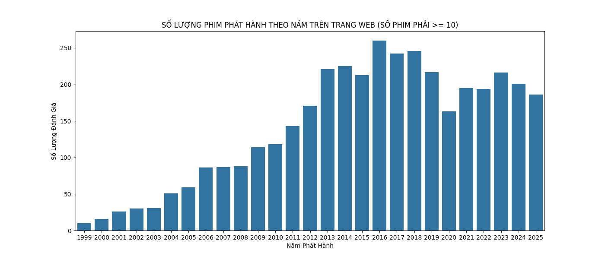
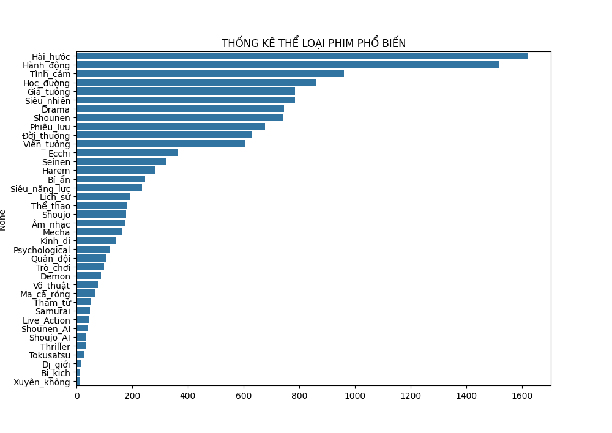
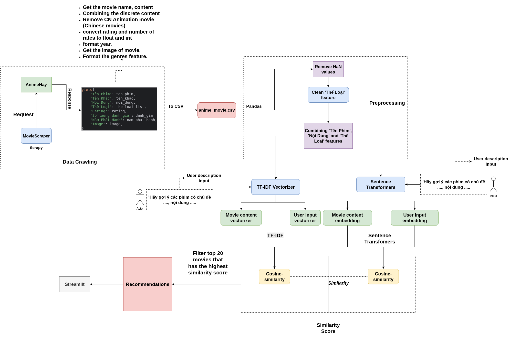

# Movie Recommendation System

---
## 1. Anime Movies Recommendation System:

---

### a. Movie Web Link: https://animehay.life/

---

### b. Report:
#### Report: [Click Here](https://www.notion.so/Movies-Recomendation-System-2ae166c00f95803db4e8cc932416cfe2?source=copy_link)
#### Charts:

---

### c. Method:

- Anime dataset was scraped from an anime web (Hope there will be no license problem :)) )
- Scrapy was used to collect anime dataset. **[Details](https://github.com/yuuMQ/MovieRecommendationSystem/blob/main/MovieScraper/MovieScraper/spiders/anime_movie_scraper.py)**
- We use a ***Content-based recommendation System*** for anime movies dataset:
- *'Thể Loại'*, *'Nội Dung'* and *'Tên Phim'* features are merged into a *'movie_content_data' feature.  
- The recommendation System has two different methods:
  - TF-IDF
  - Sentence Transformer
---

### d. Dataflow:

---
 
## 2. Vietnamese and Other Movies Recommendation System: ***TO BE CONTINUE***
### a. Movie Web Link: https://phimmoi15.net/
### b. Report:
### c. Demo:

---

## Team Members:
- 2351010176 - Phạm Minh Quân
- 2351010238 - Lê Khắc Tùng
